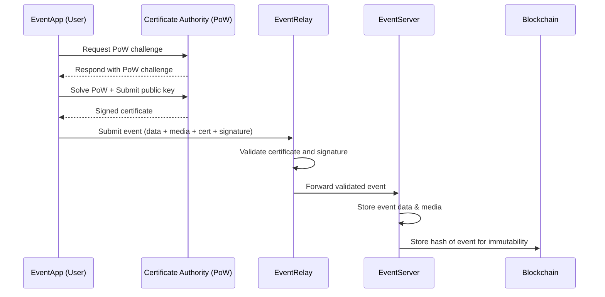

# Components Documentation

This document provides an overview of the React components located in the `src/components/` directory of the EventApp project. These components are built using React and styled with Tailwind CSS, focusing on a clean, modular, and responsive design.

## 1. `App.tsx`

The `App.tsx` file serves as the root component of the EventApp application. It is responsible for:

- **Initialization:** Manages the initialization of cryptographic keys and fetching of labels required for the application to function.
- **State Management:** Displays loading and error states during the initialization process.
- **Layout:** Sets up the main layout of the application, including the soft azure-blue background and the centered form container with a backdrop blur effect.
- **Routing (Implicit):** Although not explicitly a router, it conditionally renders the `EventForm` once `keyPair` and `labels` are loaded, acting as the primary entry point for the user interface.
- **Toaster:** Integrates `sonner` for displaying toast notifications.

## 2. `CameraCapture.tsx`

The `CameraCapture.tsx` component provides functionality for capturing images using the device's camera or selecting them from the gallery.

- **Camera Access:** Handles requesting and managing access to the device's camera.
- **Live Preview:** Displays a live video feed from the camera.
- **Photo Capture:** Allows users to capture a photo from the live feed.
- **Gallery Selection:** Provides an option to select an image from the device's photo gallery.
- **Image Preview:** Shows a preview of the captured or selected image.
- **Error Handling:** Manages and displays errors related to camera access or invalid file types.
- **Props:**
  - `onCapture`: Callback function triggered when an image is successfully captured or selected.
  - `onError`: Optional callback function for handling errors.
  - `className`: Optional CSS classes for styling the component.
  - `disabled`: Boolean to disable camera functionality.

## 3. `EventForm.tsx`

The `EventForm.tsx` component is the main container for the event submission form. It orchestrates the state and logic for the entire form, delegating rendering responsibilities to its sub-components.

- **Form State:** Manages the `formData`, `errors`, `mediaFile`, and `isSubmitting` states for the entire form.
- **Validation:** Implements the `validate` function to ensure all required fields and media are present and meet constraints before submission.
- **Submission Logic:** Handles the `handleSubmit` function, which packages the event data, sends it to a relay, and provides user feedback via toasts.
- **Sharing Logic:** Implements `handleShareClick` to export the event package as a ZIP file.
- **Delegation:** Renders `EventFormFields`, `EventFormMedia`, and `EventFormActions` components, passing necessary props and callbacks.
- **Props:**
  - `labels`: An array of `Label` objects defining the form fields.
  - `keyPair`: The cryptographic key pair used for signing event submissions.

## 4. `EventFormActions.tsx`

The `EventFormActions.tsx` component is responsible for rendering the action buttons of the event submission form.

- **Submit Button:** Displays a "Submit" button that triggers the form submission process. It includes a loading spinner when the form is submitting.
- **Share Button:** Provides a "Share as Zip" button to export the event data.
- **State Management:** Receives `isSubmitting` prop to disable buttons during submission.
- **Props:**
  - `isSubmitting`: Boolean indicating if the form is currently submitting.
  - `handleSubmit`: Callback function for form submission.
  - `handleShareClick`: Callback function for sharing the event as a ZIP.

## 5. `EventFormFields.tsx`

The `EventFormFields.tsx` component dynamically renders the various input fields of the event submission form based on the provided `labels` configuration.

- **Dynamic Rendering:** Iterates through the `labels` array and renders appropriate input types (text, number, date, enum, boolean).
- **Input Handling:** Manages `handleChange` for updating form data.
- **Validation Feedback:** Displays error messages for individual fields.
- **Props:**
  - `labels`: An array of `Label` objects defining the form fields.
  - `formData`: The current state of the form data.
  - `errors`: An object containing validation errors for each field.
  - `handleChange`: Callback function to update form data.
  - `i18n`: The i18next instance for internationalization.
  - `t`: The translation function from i18next.
  - `isSubmitting`: Boolean to disable fields during submission.

## 6. `EventFormMedia.tsx`

The `EventFormMedia.tsx` component handles the media capture section of the event submission form.

- **Media Input:** Integrates the `CameraCapture` component for photo capture and gallery selection.
- **Media Preview:** Displays a preview of the captured or selected media file.
- **Feedback:** Shows success messages (file name and size) and error messages related to media capture.
- **Props:**
  - `mediaFile`: The currently selected media file.
  - `handleMediaCapture`: Callback function for handling captured media.
  - `handleMediaError`: Callback function for handling media capture errors.
  - `errors`: An object containing validation errors, specifically for media.

