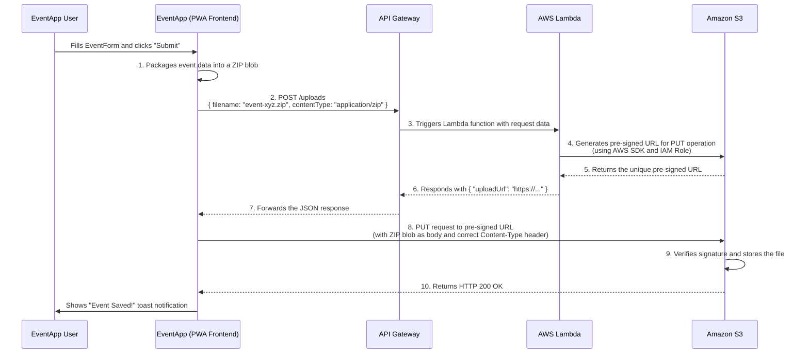

# Architecture: Secure Serverless S3 Uploads

This document outlines the architecture for securely uploading event packages from the **EventApp (PWA)** to Amazon S3 without exposing any sensitive credentials on the frontend. This pattern replaces the current insecure method in `src/components/EventForm.tsx` which embeds the AWS Access Key and Secret Key directly in the client-side code.

## 1. The Core Problem

The current implementation in `EventForm.tsx` initializes the `S3Client` with hardcoded or environment-variable-based AWS credentials.

```typescript
// Current insecure code in EventForm.tsx
const s3Client = new S3Client({
  region: import.meta.env.VITE_AWS_REGION,
  credentials: {
    accessKeyId: import.meta.env.VITE_AWS_ACCESS_KEY_ID, // EXPOSED
    secretAccessKey: import.meta.env.VITE_AWS_SECRET_ACCESS_KEY, // EXPOSED
  },
});
```

This is a **critical security vulnerability**. Anything included in the Vite build (`VITE_*` variables) is publicly visible in the browser. An attacker could easily steal these credentials and gain full write access to your S3 bucket.

## 2. The Solution: Pre-signed S3 URLs

To fix this, we will adopt a serverless approach using **API Gateway** and **AWS Lambda** to act as a secure broker. The frontend will no longer have any knowledge of AWS credentials. Instead, it will ask our secure API for a special, temporary, one-time-use link called a **pre-signed URL**.

The new flow involves three main parties:

1.  **EventApp (PWA)**: The user's browser.
2.  **Your Secure API**: An AWS Lambda function fronted by API Gateway.
3.  **Amazon S3**: Your private file storage.

### Visual Flow

This diagram illustrates the complete, secure upload process from start to finish.



## 3. Detailed Component Breakdown

### a. EventApp Frontend (`src/components/EventForm.tsx`)

The `handleSubmit` function will be modified significantly:

1.  **Remove `S3Client`**: All code related to `S3Client` and direct AWS credential handling will be deleted.
2.  **API Call to Get URL**: After creating the `zipBlob`, the app will make a `POST` request to our new API Gateway endpoint (e.g., `https://<api-id>.execute-api.<region>.amazonaws.com/prod/uploads`). The request body will contain the desired `filename` and the file's `contentType`.
3.  **Upload to S3**: The app will use the `uploadUrl` received from the API to perform a `PUT` request, with the `zipBlob` as the body.

**Example Frontend Code Change:**

```typescript
// Inside handleSubmit in EventForm.tsx

// ... after creating the eventPackage and zipBlob

try {
  // 1. Get a pre-signed URL from our secure backend
  const response = await fetch("https://<your-api-id>.amazonaws.com/uploads", {
    method: "POST",
    headers: { "Content-Type": "application/json" },
    body: JSON.stringify({
      filename: `event-${eventPackage.id}.zip`,
      contentType: "application/zip",
    }),
  });

  const { uploadUrl } = await response.json();

  // 2. Upload the file directly to S3 using the pre-signed URL
  await fetch(uploadUrl, {
    method: "PUT",
    body: zipBlob,
    headers: { "Content-Type": "application/zip" },
  });

  toast.success(t("eventSaved"));
} catch (error) {
  console.error("Error saving event:", error);
  toast.error(t("saveError"));
}
```

### b. AWS Lambda Function (The Secure Broker)

This is the core of our new secure backend. It's a small, stateless function.

- **Trigger**: It will be triggered by API Gateway.
- **Logic**: It will parse the `filename` and `contentType` from the request body.
- **Permissions**: It will execute with an **IAM Role** that grants it `s3:PutObject` permissions for your bucket. This is the _only_ place where AWS permissions are configured.
- **Action**: It will use the AWS SDK (`@aws-sdk/s3-request-presigner`) to generate a pre-signed URL valid for a short time (e.g., 5 minutes).
- **Response**: It will return a `200 OK` response with the URL in the body.

### c. API Gateway

This service provides the public HTTP endpoint for our Lambda function.

- **Resource**: A new resource, e.g., `/uploads`.
- **Method**: A `POST` method on the `/uploads` resource.
- **Integration**: This `POST` method will be configured to trigger our Lambda function.
- **CORS**: You must enable CORS on the API Gateway endpoint to allow requests from your web application's domain.

### d. Amazon S3 Bucket

Your S3 bucket will remain private. However, it needs one crucial configuration change:

- **CORS Configuration**: You must add a CORS policy to the bucket itself. This policy will explicitly allow `PUT` requests from your application's origin (`https://NkwaTambe.github.io`). Without this, the browser will block the `PUT` request from the frontend to S3.

**Example S3 CORS Policy:**

```xml
<?xml version="1.0" encoding="UTF-8"?>
<CORSConfiguration xmlns="http://s3.amazonaws.com/doc/2006-03-01/">
<CORSRule>
    <AllowedOrigin>https://NkwaTambe.github.io</AllowedOrigin>
    <AllowedMethod>PUT</AllowedMethod>
    <AllowedHeader>*</AllowedHeader>
    <MaxAgeSeconds>3000</MaxAgeSeconds>
</CORSRule>
</CORSConfiguration>
```

## 4. Security Benefits of this Architecture

- **No Exposed Credentials**: The frontend code contains zero AWS keys.
- **Least Privilege**: The Lambda function's IAM role is tightly scoped, only allowing it to generate upload links. It cannot read or delete files.
- **Time-Limited Access**: The pre-signed URLs expire automatically, minimizing the risk if one were ever leaked.
- **Scalable & Cost-Effective**: This serverless pattern scales automatically with demand and you only pay for what you use (Lambda invocations and API Gateway requests).
